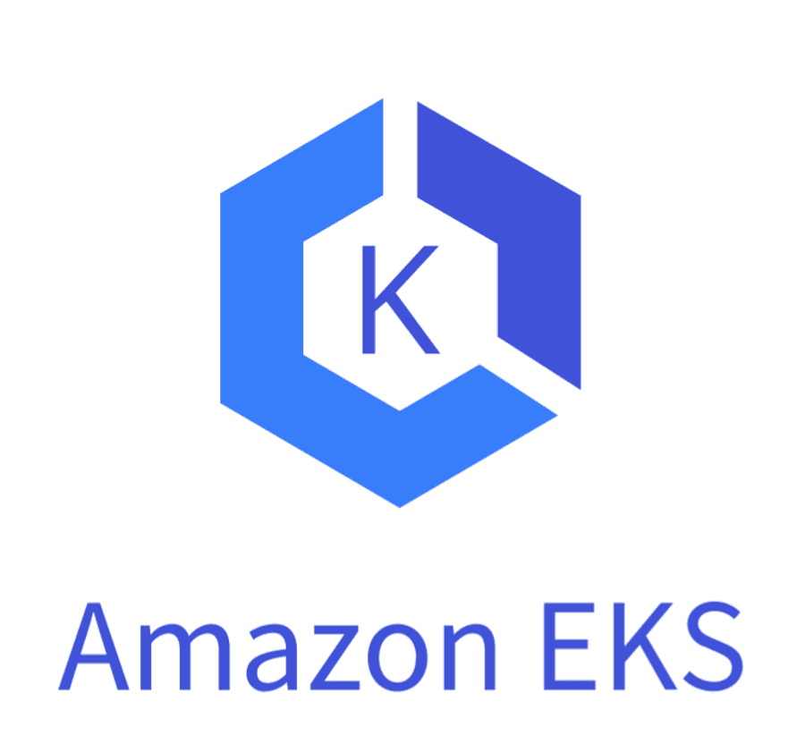

# EKS 가 뭔가

Amazon Elastic Kubernetes Service(Amazon EKS)는 AWS 클라우드와 온프레미스 데이터 센터에서 Kubernetes를 실행하는 데 사용되는 관리형 Kubernetes 서비스이다.

Amazon EKS를 사용하면 AWS 네트워킹 및 보안 서비스와의 통합뿐만 아니라 AWS 인프라의 모든 성능, 규모, 신뢰성 및 가용성을 활용할 수 있다.

# 쿠버네티스란 뭔가

아 이거 전에 컨테이너부터 알고 있는게 좋겠다.