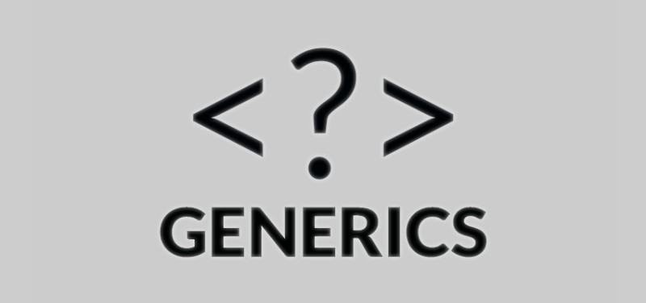
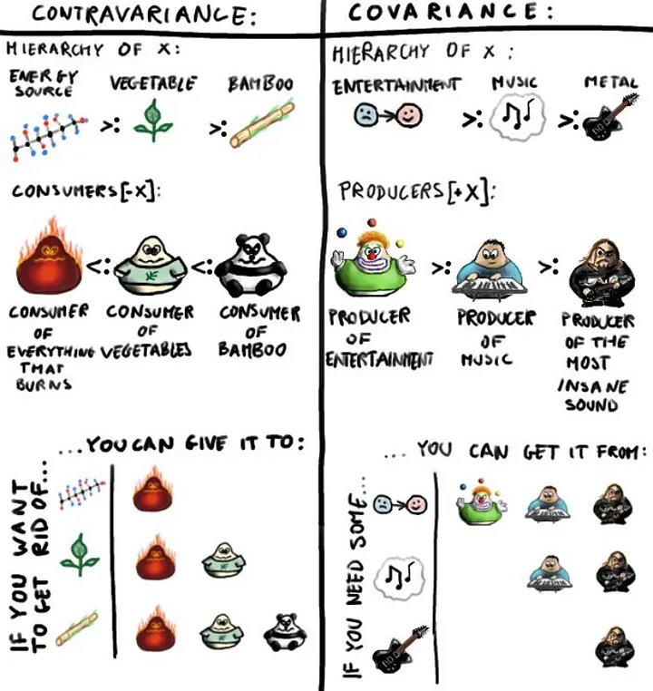

# 제네릭이란



데이터의 타입(data type)을 일반화한다(generalize)는 것을 의미한다.

제네릭은 클래스나 메소드에서 사용할 내부 데이터 타입을 컴파일 시에 미리 지정하는 방법이다.

이렇게 컴파일 시에 미리 타입 검사(type check)를 수행하면 다음과 같은 장점을 가진다.

```java
// List<T>

List<String> stringList = new ArrayList<>();
```

## 제네릭의 장점
1. 클래스나 메소드 내부에서 사용되는 객체의 타입 안정성을 높일 수 있다.

```java
    // no generic
    List stringList = new ArrayList<>();
    stringList.add("ryeoryeo");
    stringList.add(1);
    String result = (String) stringList.get(0) + (String) stringList.get(1); // runtime error!
    
    // generic
    List<String> stringList = new ArrayList<>();
    stringList.add("ryeoryeo");
    stringList.add(1);  // compile error!!
```

2. 반환값에 대한 타입 변환 및 타입 검사에 들어가는 노력을 줄일 수 있다.

```java
    // no generic
    List stringList = new ArrayList<>();
    stringList.add("ryeoryeo");
    String result = (String) stringList.get(0);  // 반환 타입 지정해줘야 함!!

    // generic
    List<String> stringList = new ArrayList<>();
    stringList.add("ryeoryeo");
    String result = stringList.get(0);
```

# 변성이란
    변성이란 제네릭에서 형식 매개변수가 클래스 계층에 어떤 영향을 미치는지를 말한다.

공변과 반공변 무변성 이라는 세 유형으로 나눌 수 있다.

T가 T`의 상위 자료형이라 할 때

| 무변성<br>(Invariance) | 공변성<br>(Covariance) | 반공변성<br>(Contravariance) |
|---------------------|---------------------|--------------------------|
|C<T>는 C<T`>와 아무 관련이 없다.| C<T>는 C<T`>의 상위 자료형이다.<br> out으로 지정|C<T>는 C<T`>의 하위 자료형이다.<br> in으로 지정|


코틀린은 무변성을 디폴드로 한다.

```kotlin
    val strs: MutableList<String> = mutableListOf()
    
    val objs: MutableList<Any> = strs 
    // !!! A compile-time error here saves us from a runtime exception later

    objs.add(1) // Here we put an Integer into a list of Strings

    val s: String = strs[0] // !!! ClassCastException: Cannot cast Integer to String
```
위 코드에서 `MutableList<String>`가 `MutableList<Any>`의 하위 자료형이었다면, 네번째 코드에서 Int형을 String으로 캐스팅할 수 없기 때문에 예외가 발생한다.

따라서 런타임 안정성을 보장하기 위해 무변성을 기본으로 하는 것이다. 

즉 `MutableList<String>`와 `MutableList<Any>`는 아무 관련이 없는 것이다.

하지만 지원하는 것처럼(?) 보여주는 컴파일러 트릭을 사용한다. `<? extends T>`, `<? super T>` 키워드가 바로 그것이다.

조슈아 블로흐는 프로그래머들이 언제 super 키워드를 쓰고, 언제 extends 키워드를 써야 하는지 기억하는 것을 돕기 위해서 이른바 '펙스(PECS)' 라는 공식까지 만들었다. "Producers Extend, Consumers Super!"의 약자이다.

코틀린은 `out` 과 `in` 이라는 키워드로 `PECS` 공식을 표현한다.

## 공변

```kotlin
class Producer<out T>(
    private val value: T
) {
    fun get(): T {
        return value
    }
    
    fun set(value: T) {
        this.value = value
    }
}
```
공변이란 타입 인자의 하위 타입 관계가 제네릭의 타입 파라메터에도 유효한 것이다.

공변하는 제네릭 클래스는 생산만 가능하다.

근데 이 클래스에 아래와 같은 `set` 메서드를 작성한다면

```kotlin
fun set(value: T) {
    this.value = value
}
```

`out` 변성을 지정한 클래스 타입 파라메터가 `in` position에 나타났다는 에러가 발생한다고 한다.

한마디로 `out` 변성의 타입 파라메터를 가진 클래스는 소비할 수 없다.

## 반공변
반공변에서는 하위타입 관계가 뒤집히며, 소비만 가능해지는 소비자가 된다.

```kotlin
class Consumer<in T>{
    fun consume(value: T) {
        println("Consume value: $value")
    }
}
```

위에서와 비슷하게 소비자에게 값을 생성하는 메서드를 추가하면 컴파일 에러가 발생한다고 한다.
```kotlin
fun produce(): T {
    return this.value
}
```

해당 타입 파라메터가 `out` position에 나타난다는 에러가 난다고 한다.

`in` position 변성을 지정한 클래스는 생산할 수 없다.


이제까지 한 것은 선언지점 변성으로 클래스 선언부에 지정한 변성을 말하는데 자바는 불가능하다고 한다.

해당 변성이 사용되는 지점에만 한정적으로 와일드 카드를 사용해서 변성을 지정할 수 있다고 하는데 이게 사용지점 변성이다.

```kotlin
fun <E> union(first: MutableSet<out E>, second: MutableSet<out E>): Set<E> {
    //TODO
    // 각 Set 요소들을 꺼내서 합치는 코드를 작성했다고 가정
}
```
위처럼 두 개의 Set 을 합치는 메서드 내부의 로직이 각 Set 의 요소를 꺼내서 합친 후 새로운 Set 을 반환하는 코드라 가정하면 파라메터로 전달받는 `first`와 `second`의 변성은 `out` 으로 정의해야 한다.

`MutableSet` 컨테이너는 무공변이기 때문에 변성(`out`)을 지정했다. 하지만 코틀린의 `Set` 클래스는 태생이 공변적이므로, 메서드 시그니처의 파라메터 타입을 `Set`으로 지정하면 따로 변성을 지정할 필요가 없다.

아래는 공변과 반공변을 나타내는 예시 그림이다.



사실, 실무를 하면서 직접 변성을 지정하며 클래스를 설계하고 그것을 사용하는 비즈니스 로직을 작성하는 것은 거의 드물 것이라 단언할 수 있다고 한다.
하지만 언제 어느 상황에서 비즈니스 요구사항을 마주하며 변성을 사용하게 될지 모르니 무엇인지 이해하고 있도록 하자!

## 참고
[TCP school](https://www.tcpschool.com/java/java_generic_concept#google_vignette)

[우테코 그린론의 제네릭](https://www.youtube.com/watch?v=w5AKXDBW1gQ)

[asuraiv님 tistory](https://asuraiv.tistory.com/16)