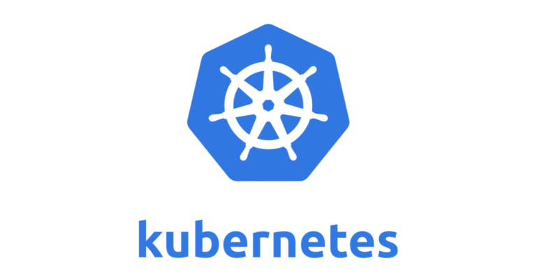
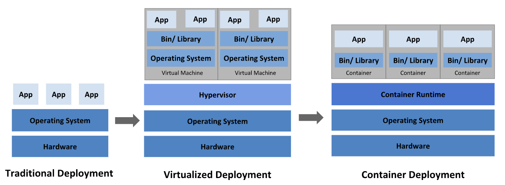
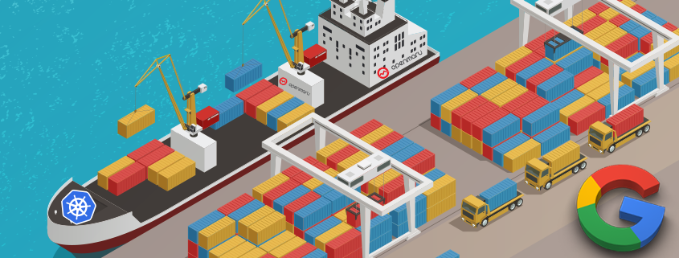
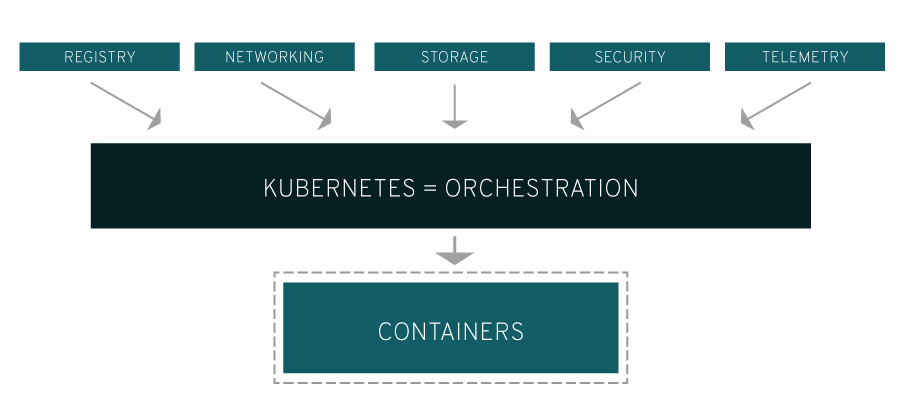
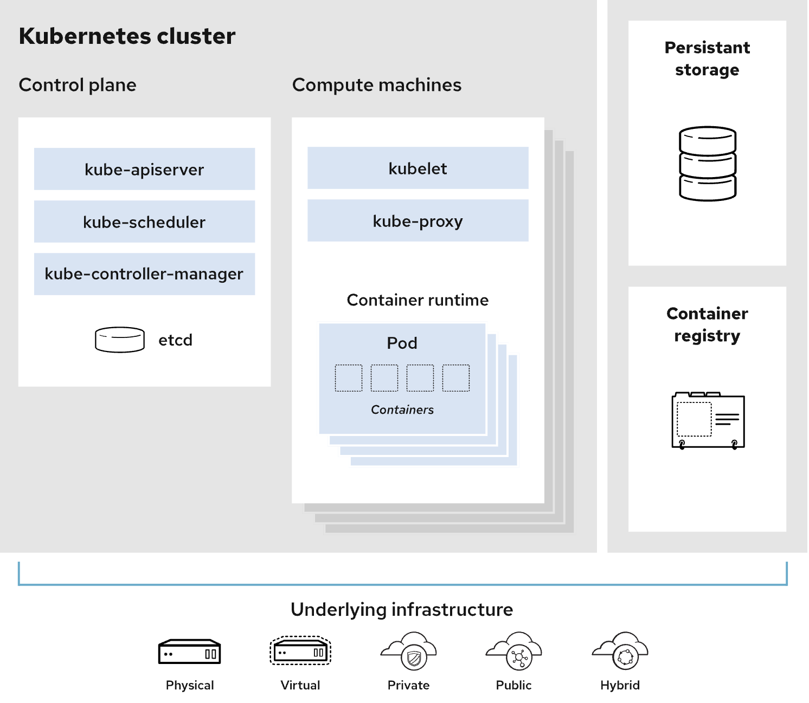

# 쿠버네티스

개발자들은 컨테이너화를 통해서 더욱 신속하게 움직이고, 효율적으로 소프트웨어를 배포하여 높은 수준의 확장성을 확보할 수 있게 되었다.

구글같은 경우에는 매주 수십억 개가 넘는 컨테이너를 생성한다.

이렇게 컨테이너가 많아진다면 이를 관리하기 위한 툴이 필요하기에 기존 가지고 있던 Borg의 아이디어를 바탕으로 개발하였다.

# 그간의 배포 방식의 변화

기존 물리 서버에 직접 배포하는 방식에서 VM 을 활용한 배포, 그리고 요즘의 컨테이너를 활용한 개발로 진화해 가고 있다.

## 컨테이너 배포
컨테이너 개발 시대: 컨테이너는 VM과 유사하지만 격리 속성을 완화하여 애플리케이션 간에 운영체제(OS)를 공유한다. 그러므로 컨테이너는 가볍다고 여겨진다. VM과 마찬가지로 컨테이너에는 자체 파일 시스템, CPU 점유율, 메모리, 프로세스 공간 등이 있다. 기본 인프라와의 종속성을 끊었기 때문에, 클라우드나 OS 배포본에 모두 이식할 수 있다.

# 쿠버네티스로 할 수 있는 것

쿠버네티스는 분산 시스템을 탄력적으로 실행하기 위한 프레임 워크를 제공한다. 애플리케이션의 확장과 장애 조치를 처리하고, 배포 패턴 등을 제공한다. 예를 들어, 쿠버네티스는 시스템의 카나리아 배포를 쉽게 관리할 수 있다.

- 참고 링크 [롤링, 블루그린, 카나리 or 카나리아](https://reference-m1.tistory.com/211)

- <b>서비스 디스커버리와 로드 밸런싱</b> 
    - 쿠버네티스는 DNS 이름을 사용하거나 자체 IP 주소를 사용하여 컨테이너를 노출할 수 있다. 컨테이너에 대한 트래픽이 많으면, 쿠버네티스는 네트워크 트래픽을 로드밸런싱하고 배포하여 배포가 안정적으로 이루어질 수 있다.
- <b>스토리지 오케스트레이션</b>
    - 쿠버네티스를 사용하면 로컬 저장소, 공용 클라우드 공급자 등과 같이 원하는 저장소 시스템을 자동으로 탑재할 수 있다
- <b>자동화된 롤아웃과 롤백</b>
    - 쿠버네티스를 사용하여 배포된 컨테이너의 원하는 상태를 서술할 수 있으며 현재 상태를 원하는 상태로 설정한 속도에 따라 변경할 수 있다. 예를 들어 쿠버네티스를 자동화해서 배포용 새 컨테이너를 만들고, 기존 컨테이너를 제거하고, 모든 리소스를 새 컨테이너에 적용할 수 있다.

- <b>자동화된 빈 패킹(bin packing)</b> 
    - 컨테이너화된 작업을 실행하는데 사용할 수 있는 쿠버네티스 클러스터 노드를 제공한다. 각 컨테이너가 필요로 하는 CPU와 메모리(RAM)를 쿠버네티스에게 지시한다. 쿠버네티스는 컨테이너를 노드에 맞추어서 리소스를 가장 잘 사용할 수 있도록 해준다.
- <b>자동화된 복구(self-healing)</b> 
    - 쿠버네티스는 실패한 컨테이너를 다시 시작하고, 컨테이너를 교체하며, '사용자 정의 상태 검사'에 응답하지 않는 컨테이너를 죽이고, 서비스 준비가 끝날 때까지 그러한 과정을 클라이언트에 보여주지 않는다.
- <b>시크릿과 구성 관리</b>
    - 쿠버네티스를 사용하면 암호, OAuth 토큰 및 SSH 키와 같은 중요한 정보를 저장하고 관리할 수 있다. 컨테이너 이미지를 재구성하지 않고 스택 구성에 시크릿을 노출하지 않고도 시크릿 및 애플리케이션 구성을 배포 및 업데이트할 수 있다.

# 쿠버네티스 클러스터

쿠버네티스 클러스터는 컨트롤 플레인과 컴퓨팅 머신(또는 노드)의 2개 부분으로 시각화할 수 있다.

각 노드는 자체 Linux 환경이며 물리 또는 가상 머신일 수 있다. 각 노드는 컨테이너로 이루어진 포드를 실행힌다. 

컨트롤 플레인은 어느 애플리케이션을 실행하고 애플리케이션이 어느 컨테이너 이미지를 사용할지와 같이 클러스터를 원하는 상태로 유지 관리한다. 컴퓨팅 머신은 애플리케이션과 워크로드를 실제로 실행한다. 컨트롤 플레인은 관리자(또는 DevOps 팀)로부터 명령을 전달받고 해당 지침을 컴퓨팅 머신에 전달한다.

- 쿠버네티스 클러스터는 간단한 선언 구문을 사용하여 애플리케이션을 정의하고 배포할 수 있게 해주는 오케스트레이션 API를 제공
- 오류가 있는 경우 애플리케이션을 복구하는 수많은 온라인 자가 재해 복구 알고리즘을 자체척으로 제공
- 쿠버네티스 API는 소프트웨어 무중단 업데이트를 더욱더 쉽게 수행 할 수 있게 배포
- 서비스의 여러 레플리카 간에 트래픽을 쉽게 분산할 수 있는 서비스 로드밸런서 개념을 제공
- [컨테이너 레지스트리](https://www.redhat.com/ko/topics/cloud-native-apps/what-is-a-container-registry)

쿠버네티스 실행 위치도 원하는 대로 선택할 수 있다. 즉, 베어 메탈 서버, 가상 머신(VM), 퍼블릭 클라우드 제공업체, 프라이빗 클라우드, 하이브리드 클라우드 환경 등에서 실행할 수 있다. 쿠버네티스의 주요 장점 중 하나는 다양한 종류의 인프라에서 작동한다는 것이다.

관리자가 모든 노드에서 모든 컨테이너에 대해 작업을 직접 수행하는 것이 아니라 자동화된 시스템이 이러한 작업을 Docker에 요청한다는 것이다.

## 쿠버네티스 용어 설명

- 컨트롤 플레인: 
    - 쿠버네티스 노드를 제어하는 프로세스의 컬렉션이다. 여기에서 모든 태스크 할당이 시작된다.

- 노드: 
    - 컨트롤 플레인에서 할당된 요청 태스크를 수행하는 머신이다.

- 포드: 
    - 단일 노드에 배포되는 하나 이상의 컨테이너 집합이다. 포드는 가장 작고 단순한 쿠버네티스 오브젝트이다.

- 서비스: 
    - 일련의 포드에서 네트워크 서비스로 실행 중인 애플리케이션을 노출하는 방식이다. 이로 인해 작업 정의가 포드에서 분리된다.

- 볼륨: 
    - 포드의 컨테이너에 액세스할 수 있는 데이터가 포함된 디렉토리이다. 쿠버네티스 볼륨은 이 볼륨을 묶는 포드와 수명이 같다. 볼륨은 포드 내에서 실행되는 모든 컨테이너보다 오래 지속되며, 컨테이너를 다시 시작해도 데이터는 보존된다.

- 네임스페이스: 
    - 가상 클러스터이다. 네임스페이스를 통해 쿠버네티스는 동일한 물리 클러스터 내에 있는 여러 클러스터(여러 팀 또는 프로젝트 용도)를 관리할 수 있다.

# 출처
[레드햇](https://www.redhat.com/ko/topics/containers/what-is-kubernetes)

[쿠버설명 깃헙](https://leehosu.github.io/managing-kubernetes-01?ref=codenary)

[공식](https://kubernetes.io/ko/docs/concepts/overview/)

[레드햇 클러스터 설명](https://www.redhat.com/ko/topics/containers/what-is-a-kubernetes-cluster)